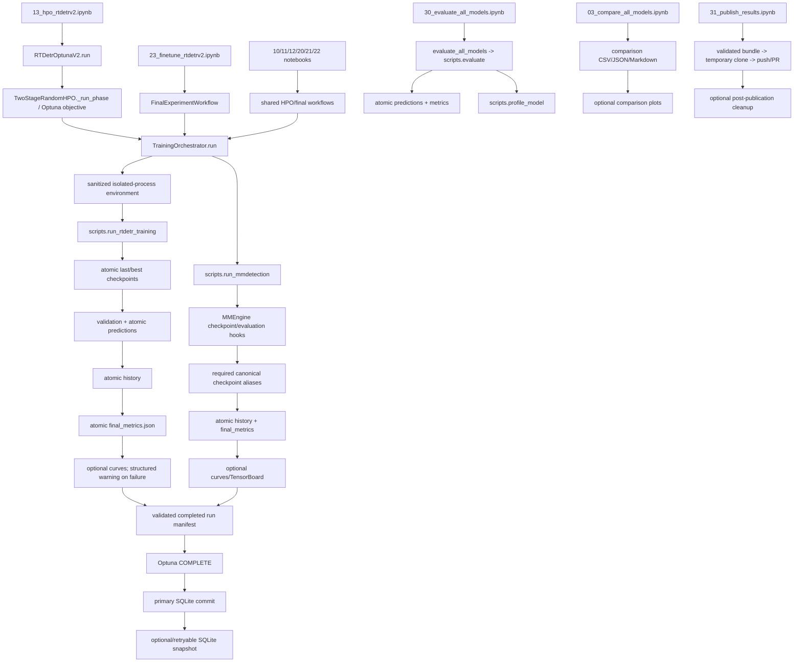
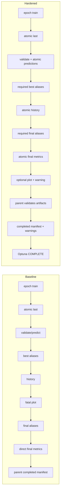
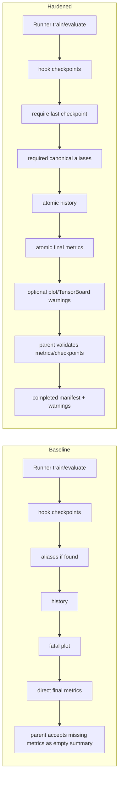

# Runtime finalization hardening audit

Audit baseline: `main` at `32dab531d1706bc9eb4fe38679c58f1c4d00d43a`.

This audit distinguishes scientific artifacts from presentation artifacts. It does
not claim GPU correctness: all automated validation described here is CPU/static or
uses mocked training boundaries. Colab and CUDA validation remain release gates.

## 1. Root cause of the observed failure

The fatal call was `save_training_curves()` in `src/training/callbacks.py`, reached
from `scripts/run_rtdetr_training.py` after the epoch checkpoint, validation,
checkpoint-selection updates, and history write. `TrainingOrchestrator` launched the
isolated Python with `subprocess.Popen()` and no `env` argument, so the complete Colab
kernel environment was inherited. The inherited value was:

```text
MPLBACKEND=module://matplotlib_inline.backend_inline
```

No repository notebook or bootstrap file sets that value. It originates in the
notebook/IPython process and leaked through the parent environment. The isolated
RT-DETR requirements contain Matplotlib but do not contain `matplotlib-inline`.
Installing that package would not be the correct architecture: a noninteractive
training subprocess should never depend on a live IPython display backend.

The deterministic CUDA warnings are unrelated. They were warnings because
`seed_everything()` uses `torch.use_deterministic_algorithms(True, warn_only=True)`.
They did not select the Matplotlib backend and did not raise the plotting exception.

For the observed one-epoch trial, `last.pth`, the epoch prediction file, evaluation
results used in memory, metrics history, and likely the selected best checkpoint were
already written. `final_metrics.json` had not yet been written. The child returned
nonzero, the parent marked `run_manifest.json` as `failed`, and Optuna marked the
trial `FAIL` because the error was neither OOM nor numerical divergence. The primary
SQLite database persisted that failed state, but the post-trial snapshot hook did not
run because `study.optimize()` re-raised the unexpected error.

Rerunning HPO does not resume that failed trial. Completed-count logic ignores it and
creates a new trial number and directory, repeating GPU work. Rerunning final training
is safer: `FinalExperimentWorkflow` finds `last.pth` under a matching resume contract
and resumes/finalizes the same run. Existing Optuna databases and Drive artifacts must
not be deleted.

## 2. Runtime call graph



## 3. Findings table

| Severity | Confidence | File/function | Trigger | Baseline behavior | Intended behavior / smallest safe repair | Scientific impact | User symptom | Required test | Rollback |
|---|---|---|---|---|---|---|---|---|---|
| Critical | Confirmed | `src/training/trainer.py::_run_backend_process` | Notebook-specific environment inherited | Child receives inline backend, notebook paths, display, and rank state | Build explicit single-process child env; set `MPLBACKEND=Agg`, writable `MPLCONFIGDIR`, deterministic cuBLAS config; remove notebook/rank leakage | Valid training can be invalidated | Backend exits after GPU work | Launch child with the observed backend value and assert Agg | Revert environment builder and `env=` call |
| Critical | Confirmed | `scripts/run_rtdetr_training.py::main` | Any curve-rendering error | Exception occurs before final metrics and Optuna return | Persist checkpoints/history/final metrics first; call bounded safe plot last | Trial becomes FAIL despite valid checkpoint | HPO restarts work | Inject exact backend `ValueError`; assert critical artifacts survive | Restore per-epoch raw plot call |
| Critical | Confirmed | `scripts/run_mmdetection.py::_write_history/main` | Plot fails or no checkpoint was produced | Plot is in required history function; missing checkpoint may still produce a success-shaped summary | Require last checkpoint; atomically write history/metrics; plot last and fail open | Missing/invalid model may be registered, or valid model may fail late | Empty checkpoint paths or final crash | Missing-checkpoint fatal test and plot-warning test | Restore previous `_write_history` and alias logic |
| High | Confirmed | `TrainingOrchestrator._run_mmdetection` | Child exits zero without `final_metrics.json` | Returns `{}` and parent marks completed | Require metrics object, finite objectives, and all canonical checkpoints | Zero/invalid result can enter registry | Apparently successful run with zeros | Backend completion-contract test | Revert `_load_backend_summary` use |
| High | Confirmed | MMDetection visualizer setup | `tensorboard` absent in isolated requirements | TensorBoard backend is always enabled | Probe it as an optional backend; retain LocalVisBackend and record warning | Training startup can fail for convenience output | Import/registry error before epochs | Missing-TensorBoard configuration test | Always add TensorBoard backend |
| High | Confirmed | `src/hpo/rtdetr_v2.py::_after_trial` | Drive/SQLite snapshot copy fails | Completed primary trial is persisted, but notebook aborts | Keep primary DB authoritative; snapshot failure is structured, nonfatal, retryable | No loss of primary study; workflow interruption only | Notebook traceback after completed trial | Force backup failure; assert primary DB unchanged | Restore direct snapshot call |
| High | Confirmed | `src/utils/serialization.py` and backend writers | Disconnect during YAML/CSV/final-metrics write | Several files are truncated in place | Same-directory temp, flush, fsync, `os.replace` | Resume/config/metric corruption | JSON/YAML/CSV parse failures | Round-trip and interruption/replace tests | Restore direct writes |
| High | Confirmed | `configs/runtime_environments.yaml` | Runtime provisioning/fingerprint | Provenance still names the empty initial checkpoint revision | Pin the same complete immutable revision used by model config | Incorrect reproducibility identity | Misleading runtime manifest/cache hash | Runtime-spec equality test | Restore old revision (not recommended) |
| Medium | Confirmed | `src/evaluation/report_generator.py` and comparison | Missing `tabulate`, backend/font/cache failure | Markdown or figure exception aborts report stage | Pin `tabulate`; use text fallback; make figures/PDF structured optional outputs | Evaluation JSON remains valid | Report notebook stops | Remove `tabulate` and inject plot failure | Restore direct rendering |
| Medium | Confirmed | `src/hpo/final_workflow.py::_materialize_expected_aliases` | Legacy alias copy fails | Completed final workflow aborts on convenience alias | Preserve canonical checkpoints; warn for legacy aliases | No model loss; downstream compatibility delayed | Rerun stops at finalization | Force alias-copy error and assert completed run remains usable | Restore direct aliases |
| Medium | Confirmed | `src/workflows/publishing.py::publish_results` | Temp cleanup fails after push/PR | `finally` masks successful publication | Never mask primary error or successful publication; return cleanup warning | Published result is valid | Notebook reports failure after successful push | Force cleanup error after mocked publication | Restore unconditional cleanup |
| Medium | Confirmed | `scripts/evaluate.py` | Disconnect while prediction JSON is written | Large prediction files are written non-atomically | Use atomic JSON replace; evaluation remains fail-closed | Partial predictions can poison rerun | JSON decode/evaluator error | Interrupt temp write and retain previous file | Restore `atomic=False` |
| Medium | Likely | Runtime manifest/package enumeration | Broken package metadata or Drive failure before training | Preflight aborts before expensive work | Keep provenance required, but improve error message/retry classification | No completed training is lost | Early startup failure | Corrupt distribution metadata in isolated runtime | No code change in this hardening set |
| Low | Confirmed | Determinism policy | RT-DETR grid sampling on CUDA | Warn-only execution continues | Describe as best-effort deterministic; record warning and environment | Seed repeatability, not bitwise equality | cuBLAS/grid-sampler warnings | CUDA runtime proof on target GPU | Disable deterministic mode (not recommended) |

## 4. Failure-policy matrix

| Stage | Policy | Reason |
|---|---|---|
| Dataset/class mapping validation | Required and fatal | Wrong scientific input invalidates all outputs |
| Resume/configuration contract | Required and fatal | Incompatible optimizer/scheduler state is not resumable |
| Model/pretrained checkpoint resolution | Required and fatal | Training identity would change |
| Training loss/optimizer step | Required and fatal | Model state is invalid or incomplete |
| NaN/Inf metrics or loss | Required and fatal/prunable by explicit policy | Never convert divergence to success |
| OOM | Required but classified/prunable | Search may safely try another configuration |
| Validation and COCO/APtiny calculation | Required and fatal | HPO objectives and final claims depend on it |
| Last and best canonical checkpoints | Required and fatal | A completed run must be loadable |
| Predictions and final metrics | Required and fatal | They are scientific outputs |
| Run manifest and resume contract | Required and retryable/fatal before promotion | Identity and recovery depend on them |
| Registry update/file lock | Required but retryable | Completed run remains recoverable from its manifest |
| Primary Optuna SQLite transaction | Required and fatal | Trial state is authoritative |
| Optuna snapshot | Required but retryable | Backup must not invalidate the primary DB |
| Metrics history | Important and recoverable | Needed for diagnosis; checkpoint/metrics remain authoritative |
| Canonical checkpoint aliases named in manifest | Required and fatal | Downstream readers depend on them |
| Legacy convenience aliases | Optional and nonfatal | Canonical paths remain valid |
| Training/LR/comparison plots | Optional and nonfatal | Presentation only |
| TensorBoard backend | Optional and nonfatal | Convenience telemetry only |
| Markdown tables and PDF report | Optional and nonfatal with fallback | JSON/CSV remain authoritative |
| Profiling | Required for efficiency claims, retryable | Accuracy/training outputs remain valid |
| Git publication push/PR | Required and retryable | Local validated bundle remains valid |
| Temporary cleanup after publication | Optional and nonfatal | It must not mask publication success |

## 5. Environment-variable matrix

| Variable | Baseline parent/child | Hardened child | Policy | Set in |
|---|---|---|---|---|
| `MPLBACKEND` | Colab inline value inherited | `Agg` | Override | `build_model_subprocess_environment()` |
| `MPLCONFIGDIR` | Usually inherited/unset | Per-run writable log/cache directory | Override | Backend launcher |
| `PYTHONPATH` | Notebook/kernel paths inherited | Removed | Remove to avoid shadowing pinned environment | Environment builder |
| `IPYTHONDIR` | Inherited | Removed | Notebook-only | Environment builder |
| `JUPYTER_PATH` | Inherited | Removed | Notebook-only | Environment builder |
| `DISPLAY` | Inherited if present | Removed | Headless subprocess | Environment builder |
| `CUDA_VISIBLE_DEVICES` | Inherited | Inherited | Preserve device selection | Parent/Colab |
| `CUBLAS_WORKSPACE_CONFIG` | Missing or arbitrary | `:4096:8` | Override before child imports torch | Environment builder |
| `PYTHONHASHSEED` | Set from run seed | Inherited and recorded | Preserve | `seed_everything()` / manifest |
| `TORCH_HOME` | Optional cache path | Inherited | Preserve cache | Parent |
| `HF_HOME` | Optional cache path | Inherited | Preserve cache | Parent |
| `TRANSFORMERS_CACHE` | Optional legacy cache | Inherited and recorded | Preserve but prefer `HF_HOME` | Parent |
| `XDG_CACHE_HOME` | Optional cache root | Inherited | Preserve cache | Parent |
| `WORLD_SIZE` | Arbitrary parent value inherited | Removed for direct single-process launch | Remove; repository does not use `torchrun` | Environment builder |
| `LOCAL_RANK` / `RANK` | Arbitrary parent value inherited | Removed | Remove for direct single-process launch | Environment builder |

Notebook presentation remains free to use an inline backend in the kernel. Only
repository-owned noninteractive model/evaluation subprocesses and saved report
rendering force Agg.

## 6. Finalization-order diagrams

### RT-DETR



### MMDetection



## 7. Missing-test inventory

The baseline smoke suite did not execute the actual final plot boundary under a
sanitized isolated-process environment. Required additions are:

1. Set `MPLBACKEND=module://matplotlib_inline.backend_inline`, build the child
   environment, launch a real Python subprocess, import `pyplot`, and assert Agg.
2. Inject the exact observed `ValueError` into training-curve saving; assert that
   `final_metrics.json`, `last.pth`, `best_map.pth`, and `best_aptiny.pth` remain valid,
   the PNG may be absent, and a structured warning is written.
3. Run a one-trial Optuna phase with the injected plot warning; assert `COMPLETE`,
   rerun the phase, and assert the completed trial is not repeated.
4. Force missing `final_metrics.json`, missing canonical checkpoints, and nonfinite
   objectives; assert the parent refuses completion.
5. Force SQLite snapshot failure; assert the primary DB remains unchanged and the
   workflow continues with a warning.
6. Force missing TensorBoard, missing `tabulate`, plot/font/cache failures, legacy
   alias-copy failure, registry lock timeout, and post-publication cleanup failure.
7. Run Colab GPU smoke through finalization for one RT-DETR and one MMDetection model.
   CPU mocks cannot establish CUDA/operator correctness.

## 8. Minimal PR sequence

| PR | Dependencies | Files | Tests | Merge gate | Exact rollback |
|---|---|---|---|---|---|
| 1. Sanitize subprocess environments | None | `src/subprocess_utils.py`, backend/model-day/evaluation launchers, runtime manifest | Exact inherited-inline-backend subprocess test; environment matrix assertions | CPU/static CI green; Colab child reports Agg and correct cuBLAS config | Revert PR commit; child resumes full inheritance |
| 2. Make optional presentation fail open | PR 1 | `src/optional_outputs.py`, callbacks, LR/report/comparison/TensorBoard/cleanup callers | Exact plot exception, missing dependency, cleanup masking tests | Structured warning includes operation/type/message/log/scientific validity | Revert PR commit; optional outputs become fatal again |
| 3. Reorder and harden finalization | PR 2 | RT-DETR/MMDetection backends, trainer validation, serialization/evaluation writers | Missing metrics/checkpoint fatal tests; atomic write tests | Critical artifact contract passes; no broad exception suppression | Revert PR commit; restore baseline ordering/writers |
| 4. HPO/resume end-to-end contracts | PR 3 | HPO snapshot/final workflow tests and fixtures | COMPLETE-with-warning and no-repeat test; snapshot failure test | Primary SQLite unchanged; no existing DB migration | Revert tests and HPO hook only; do not modify study files |
| 5. Reproducibility/dependency documentation | PRs 1-4 | runtime config, requirements, licenses, methodology/audit docs | Dependency import probe; runtime revision consistency | Colab isolated environments provision from clean cache | Revert manifest/docs/dependency commit; do not reuse stale runtime cache as proof |

## 9. Release-blocking conclusion

Unhardened HPO should not continue. The baseline can waste a complete trial at the
presentation boundary and has no protection against the exact observed environment
leak. HPO may resume only after PRs 1-4 are merged and the exact CPU regression suite
passes. Before launching the complete search, run one real Colab GPU finalization smoke
for RT-DETR and one MMDetection model. Determinism must be described as **best-effort
deterministic**: seeds, cuBLAS workspace, and deterministic requests are recorded, but
RT-DETR's CUDA `grid_sample` backward path is not guaranteed bitwise deterministic
under the observed stack. Strict deterministic mode may crash and is not enabled.
